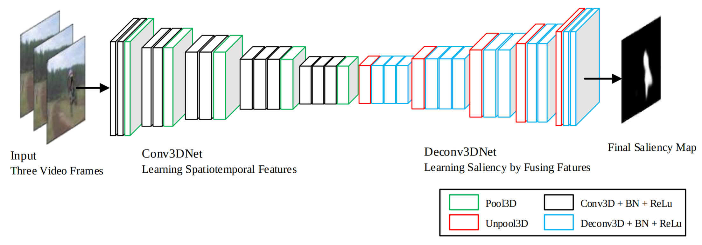
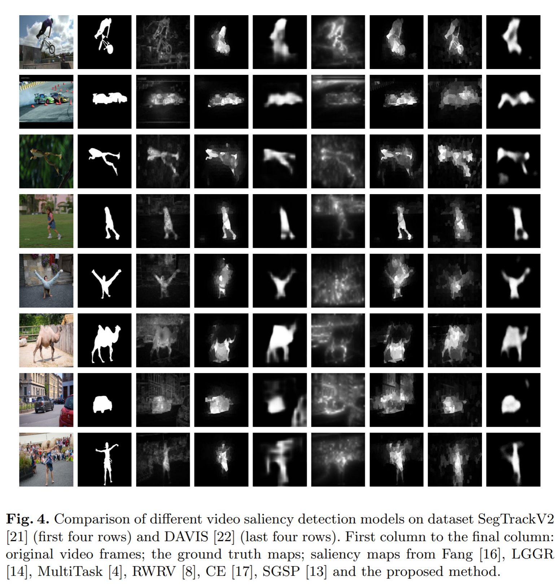

# Sal3DFCN
Source code for the paper "Video Saliency Detection by 3D Convolutional Neural Networks, [pdf](https://arxiv.org/abs/1807.04514)". 

The sorce codes are available now.

> Guanqun Ding, and Yuming Fang, Video Saliency Detection by 3D Convolutional Neural Networks, International Forum on Digital TV and Wireless Multimedia Communications(IFTC2017). Springer, Singapore, 2017.

## Performance Evaluation

### Visulization Results

